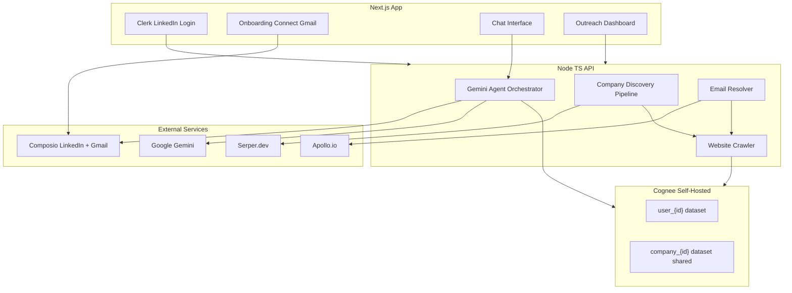
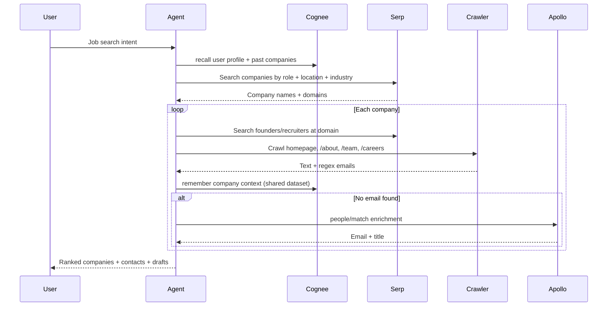

# Outpitch Platform — Implementation Plan

## Product summary

**Outpitch** helps job seekers find target companies, discover founder/recruiter contacts, and send personalized outreach — with a persistent memory graph (Cognee) that learns from each user and shares company knowledge across users.



---

## Auth strategy (your preference)

**Primary login: Clerk with LinkedIn OAuth** — one "Continue with LinkedIn" button handles app sessions, user IDs, and secure cookies.

**Composio connections** use the same Clerk `userId` as `composio.create(userId, { toolkits: ['linkedin', 'gmail'] })`:
- LinkedIn profile ingestion happens via Composio `LINKEDIN_GET_MY_INFO` after login (not a second login — a "Connect integrations" step reuses Composio hosted OAuth if needed for API scopes)
- Gmail is connected separately via Composio OAuth (user's email stays in Composio only, as you specified)

This gives you the single LinkedIn button UX while keeping production-grade session management for Cognee multi-user isolation.

---

## Monorepo structure

```
outpitch/                          # rename display name only; folder can stay OutCast
├── apps/
│   ├── web/                       # Next.js 15 (App Router, TypeScript, Tailwind, shadcn)
│   └── api/                       # Express + TypeScript REST + SSE for chat
├── packages/
│   ├── types/                     # Shared Zod schemas + TS types
│   └── db/                        # Prisma schema + client (Postgres)
├── docker/
│   └── docker-compose.yml         # Postgres, Redis, Cognee API
├── .env.example
├── package.json                   # npm workspaces
├── turbo.json
└── README.md
```

---

## Core data model (Postgres via Prisma)

| Entity | Purpose |
|--------|---------|
| `User` | Maps Clerk ID → Cognee user token, Composio connection status |
| `UserProfile` | Cached LinkedIn headline, skills, target role (from Composio) |
| `Company` | Name, domain, Serp source URL, Cognee `company_{id}` dataset name |
| `CompanyContact` | Name, title, email, source (`crawl` / `apollo`), confidence score |
| `OutreachCampaign` | User ↔ company ↔ contact, email draft, status |
| `EmailThread` | Sent/received metadata synced from Composio Gmail |
| `ChatMessage` | UI chat history (Cognee holds semantic memory; DB holds display log) |

**Cognee dataset strategy:**
- `user_{clerkUserId}` — personal graph: profile, preferences, search history, outreach outcomes, life/career context from chat
- `company_{companyId}` — **shared** company graph: what they do, team, crawled facts, found emails; readable by all users
- On discovery, API writes `UserCompanyLink` in Postgres + tags Cognee recall with both datasets so matching is seamless

---

## Memory layer — self-hosted Cognee (open source)

Run via Docker ([`cognee/cognee`](https://hub.docker.com/r/cognee/cognee)) in `docker-compose.yml`:

```yaml
services:
  cognee:
    image: cognee/cognee:latest
    environment:
      ENABLE_BACKEND_ACCESS_CONTROL: "true"
      REQUIRE_AUTHENTICATION: "true"
      LLM_PROVIDER: gemini          # uses GEMINI_API_KEY
    ports: ["8000:8000"]
```

**API wrapper** in [`apps/api/src/services/cognee.ts`](apps/api/src/services/cognee.ts) exposing the 4 memory verbs to the agent:

| Verb | Outpitch usage |
|------|----------------|
| `remember` | Ingest LinkedIn profile, crawled company pages, sent email summaries, chat facts |
| `recall` | Agent retrieves user preferences + company context before search/draft |
| `improve` | User feedback ("this company was a bad fit") refines future matching |
| `forget` | User deletes a company or resets outreach context |

Each request includes a per-user Cognee Bearer token (provisioned on first login via Cognee auth API).

---

## Company discovery pipeline

Triggered by chat ("find me frontend roles at AI startups") or explicit UI action.



**Implementations:**
- [`apps/api/src/services/serp.ts`](apps/api/src/services/serp.ts) — Serper.dev Google search + structured queries (`site:linkedin.com/in "Recruiter" "acme.com"`)
- [`apps/api/src/services/crawler.ts`](apps/api/src/services/crawler.ts) — `cheerio` + `robots-parser`; max 10 pages/company; extract emails via regex + mailto links; respect rate limits
- [`apps/api/src/services/email-resolver.ts`](apps/api/src/services/email-resolver.ts) — priority: crawl → pattern guess from known domain email → Apollo `POST /people/match` (1 credit each, only when needed)
- [`apps/api/src/jobs/company-pipeline.ts`](apps/api/src/jobs/company-pipeline.ts) — BullMQ async jobs so UI shows progress

---

## Chat agent (Gemini + tools)

[`apps/api/src/agent/outpitch-agent.ts`](apps/api/src/agent/outpitch-agent.ts) using `@google/generative-ai` with function calling:

| Tool | Action |
|------|--------|
| `searchCompanies` | Run Serp pipeline |
| `getCompanyDetails` | recall from Cognee + Postgres |
| `findContacts` | Crawl + Apollo fallback |
| `draftEmail` | Gemini + user/company memory |
| `sendEmail` | Composio `GMAIL_SEND_EMAIL` (user must confirm) |
| `rememberFact` / `recallContext` / `improveMemory` / `forgetTopic` | Cognee wrappers |
| `getOutreachStatus` | List sent emails + reply status from Gmail fetch |

Chat streams via **SSE** from [`apps/api/src/routes/chat.ts`](apps/api/src/routes/chat.ts); Next.js chat UI in [`apps/web/app/chat/page.tsx`](apps/web/app/chat/page.tsx).

---

## Composio integration

[`apps/api/src/services/composio.ts`](apps/api/src/services/composio.ts):

```typescript
const composio = new Composio({ apiKey: process.env.COMPOSIO_API_KEY });
const session = await composio.create(clerkUserId, { toolkits: ['linkedin', 'gmail'] });
// LinkedIn: LINKEDIN_GET_MY_INFO on onboarding
// Gmail: GMAIL_SEND_EMAIL, GMAIL_FETCH_EMAILS for thread tracking
```

Frontend onboarding [`apps/web/app/onboarding/page.tsx`](apps/web/app/onboarding/page.tsx):
1. Clerk LinkedIn sign-in
2. "Connect Gmail" → Composio hosted auth redirect
3. Auto-ingest LinkedIn profile → Cognee `remember`

---

## Frontend pages (Next.js)

| Route | Purpose |
|-------|---------|
| `/` | Landing + "Continue with LinkedIn" |
| `/onboarding` | Gmail connect + role preferences form |
| `/chat` | Main conversational UI (messages, tool status, email confirm modal) |
| `/companies` | Discovered companies grid with match scores |
| `/outreach` | Sent emails, reply tracking, follow-up suggestions |
| `/settings` | Connected accounts, memory management (forget company) |

UI: Tailwind + shadcn/ui, dark professional theme, streaming chat with tool-call indicators.

---

## Environment variables (`.env.example`)

```
# Auth
CLERK_SECRET_KEY=
NEXT_PUBLIC_CLERK_PUBLISHABLE_KEY=

# AI
GEMINI_API_KEY=

# Memory
COGNEE_API_URL=http://localhost:8000
COGNEE_SERVICE_TOKEN=

# Integrations
COMPOSIO_API_KEY=
SERPER_API_KEY=
APOLLO_API_KEY=

# Data
DATABASE_URL=postgresql://...
REDIS_URL=redis://localhost:6379
```

---

## Build phases (single pass, ordered)

### Phase 1 — Foundation
- Init npm workspaces monorepo, Turbo, TS configs
- Docker Compose: Postgres + Redis + Cognee
- Prisma schema + migrations
- Express API skeleton with health checks
- Next.js app with Clerk LinkedIn provider

### Phase 2 — Integrations layer
- Cognee service wrapper (remember/recall/improve/forget + dataset management)
- Composio service (LinkedIn profile fetch, Gmail send/fetch, OAuth URL generation)
- Serper.dev + crawler + Apollo clients with typed responses and error handling

### Phase 3 — Pipeline + agent
- BullMQ company discovery pipeline
- Gemini agent with all tools wired
- SSE chat endpoint

### Phase 4 — Frontend
- Onboarding flow
- Chat interface with streaming + "Confirm send" modal
- Companies + outreach dashboards

### Phase 5 — Polish
- Email confidence scoring displayed in UI
- Cognee `improve` hook from user thumbs-up/down on company matches
- README with local dev instructions (`docker compose up`, `npm run dev`)

---

## Key technical decisions

| Decision | Choice | Why |
|----------|--------|-----|
| Cognee deployment | Docker sidecar, HTTP API | Open-source, Python-native; Node backend calls REST |
| Job queue | BullMQ + Redis | Crawling/enrichment is slow; async with progress |
| Email source priority | Crawl → Apollo | Free/cheap first; Apollo only as fallback (saves credits) |
| Shared company memory | `company_{id}` dataset | Reuse crawl results for future users searching same company |
| Gmail custody | Composio only | Matches your requirement; we never store Gmail tokens |

---

## Risks and mitigations

- **LinkedIn API limits** — Composio returns lite profile fields; supplement with user-provided resume/context in chat
- **Crawl blocked by robots.txt** — Fall back to Serp snippets + Apollo; log skip reason
- **Apollo credits** — Gate enrichment behind "email not found from crawl"; bulk_match up to 10
- **Cognee TS SDK maturity** — Use HTTP API from Node rather than `@cognee/cognee-ts` for stability

---

## Verification checklist

- Clerk LinkedIn login creates user + Cognee dataset
- Composio Gmail connect sends a test email on user confirmation
- Serp search returns companies; crawler stores context in shared Cognee dataset
- Apollo fires only when crawl finds no email
- Chat recalls user memory and suggests improvements via `improve`
- Second user searching same company benefits from cached company memory
